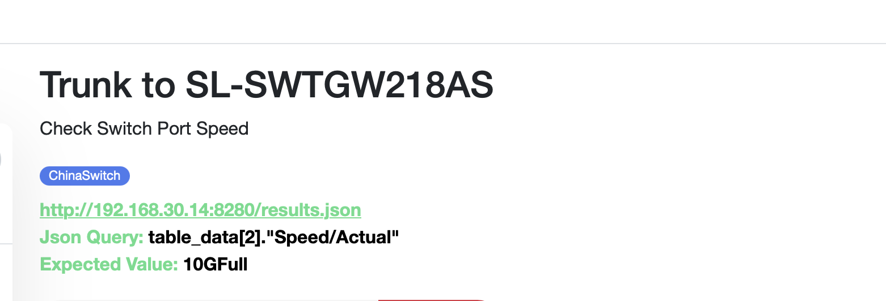
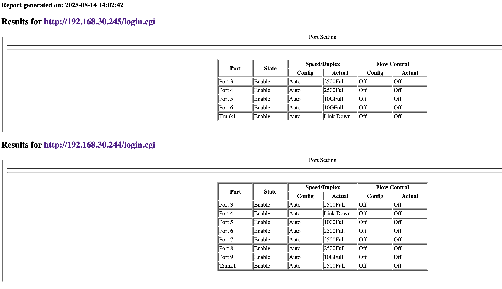
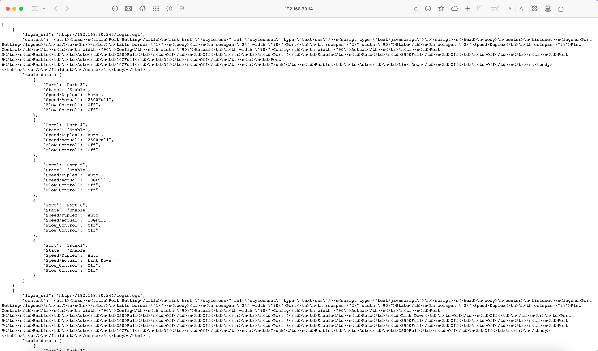

### ChinaSwitch
Monitor my cheap Multiport Switches via simple unsecure GUI and Uptime Kuma Json Query
<p>
  
</p>
<p>
  
</p>
<p>  
  
</p>

#### Docker Compose:
```
services:
  check-switch-app:
    container_name: check-switch
    image: ghcr.io/itxworks/chinaswitch:latest
    restart: always
    volumes:
      - /etc/timezone:/etc/timezone:ro
      - /etc/localtime:/etc/localtime:ro
      - ./config.json:/app/config.json:ro
      - shared-data:/data
      
  switch-www:
    image: nginx:latest
    container_name: switch-www
    restart: always
    volumes:
      - /etc/timezone:/etc/timezone:ro
      - /etc/localtime:/etc/localtime:ro
      - ./style.css:/usr/share/nginx/html/style.css
      - shared-data:/usr/share/nginx/html
      - ./nginx_config.conf:/etc/nginx/conf.d/default.conf
    ports:
      - 9980:80
volumes:
  shared-data:
```

#### Configuration: config.json
```
{
    "switches": [
        {
            "login_url": "http://192.168.30.245/login.cgi",
            "port_url": "http://192.168.30.245/port.cgi",
            "username": "admin",
            "password": "admin"
        },
        {
            "login_url": "http://192.168.30.244/login.cgi",
            "port_url": "http://192.168.30.244/port.cgi",
            "username": "admin",
            "password": "admin"
        },
        {
            "login_url": "http://192.168.30.242/login.cgi",
            "port_url": "http://192.168.30.242/port.cgi",
            "username": "admin",
            "password": "admin"
        }
    ],
    "schedule": {
        "interval_minutes": 10
    }
}
```
